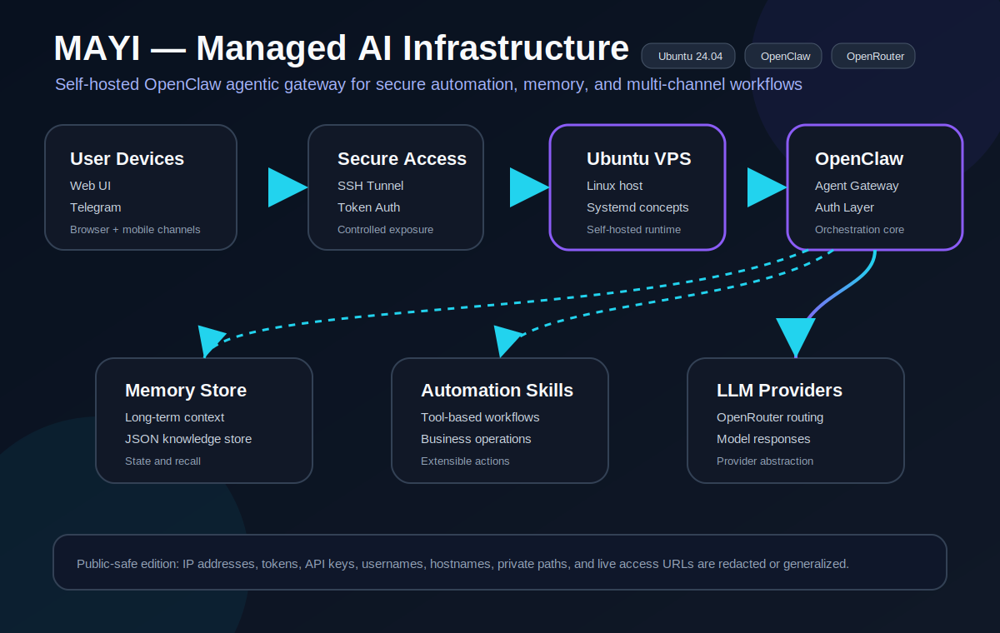

# Software Portfolio

My professional portfolio with my best current technical projects.

## Featured Projects

### MAYI — Managed AI Infrastructure
**Role:** Systems & Automation Architect  
**Focus:** Linux systems administration, secure self-hosted deployment, AI orchestration, API integration, and automation.

MAYI is a production-style, self-hosted AI agentic gateway built with the OpenClaw framework. The project was designed to move beyond a basic chatbot and create a persistent digital assistant that can support workflow automation, long-term context, and multi-channel interaction through web and Telegram interfaces.

**What this project demonstrates:**

- Deployed and managed an OpenClaw-based AI gateway on a remote Ubuntu VPS.
- Integrated web and Telegram interfaces for multi-channel assistant access.
- Connected LLM routing through OpenRouter and configured the system for practical AI workflow support.
- Worked with persistent memory, JSON-based configuration, and custom skill/plugin concepts.
- Troubleshot Linux service behavior, restart loops, port conflicts, host-header issues, and connectivity failures.
- Applied a security-conscious approach by redacting sensitive details, isolating secrets, and avoiding public exposure of infrastructure credentials.

**Tech stack:** Ubuntu 24.04, OpenClaw, OpenRouter, Linux, systemd, SSH tunneling, Socat, Telegram, Web UI, JSON configuration, persistent memory, automation skills.

[Read the full MAYI case study](docs/mayi-managed-ai-infrastructure.md)

[LinkedIn post draft](docs/mayi-linkedin-post.md)

## Security Note

Public portfolio materials intentionally remove or generalize sensitive infrastructure details such as IP addresses, tokens, API keys, usernames, hostnames, private paths, and exact access URLs.
